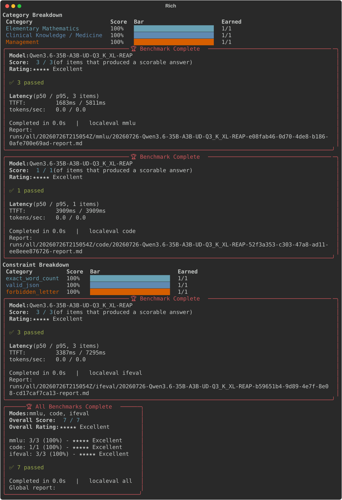
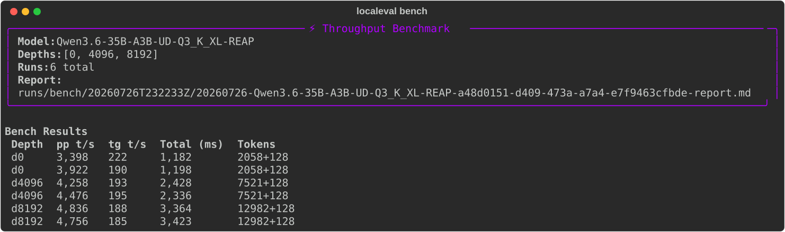

# localeval

A small, self-contained CLI to benchmark local LLMs served via any
OpenAI-compatible endpoint (llama.cpp, LM Studio, etc.). If `--base-url`
isn't given, it auto-detects a running server - see
[Server auto-detection](#server-auto-detection).

## Why this exists

An earlier eval harness reported a false 22.8% MMLU score on a
reasoning-heavy local model. Root cause, found by inspecting raw
transcripts:

1. Generation was truncated before the model finished reasoning (no
   `max_tokens` headroom for extended-thinking models).
2. The answer was extracted by grabbing "the first A/B/C/D-looking token"
   in the truncated text - which was usually the model echoing back the
   restated multiple-choice options, not an actual answer.

`localeval` avoids both mistakes: generous, configurable `max_tokens`,
explicit truncation detection via `finish_reason`, and answer extraction
that only ever trusts the *last* `FINAL ANSWER: X` line in a response -
never the first letter-like token anywhere in the text.

## What it looks like

`localeval all` running MMLU, code, and IFEval against a local model:



Each mode gets a live progress bar, a category/constraint breakdown
table, and a final summary panel with a star rating, pass/fail/error
badges, per-item latency (p50/p95 TTFT and tokens/sec), and a link to
the full per-run report.

`localeval bench` measuring prompt-processing and generation throughput
at increasing context depths:



## Stack

Python 3.11+, `requests`, `rich` (terminal output), standard library
otherwise. No eval framework dependencies.

## Setup

```bash
cd localeval
uv venv .venv
source .venv/bin/activate
uv pip install -r requirements.txt pytest
```

(`pytest` is only needed to run the test suite; runtime dependencies -
just `requests` and `rich` - are listed unpinned in `requirements.txt`.)

## Usage

```bash
python -m localeval mmlu   --questions sample_data/mmlu_sample.json
python -m localeval code   --tasks-dir sample_data/code_tasks
python -m localeval ifeval --cases sample_data/ifeval_sample.json
python -m localeval all    --questions sample_data/mmlu_sample.json \
                            --tasks-dir sample_data/code_tasks \
                            --cases sample_data/ifeval_sample.json
```

Against a real server, with a named model and a larger question bank:

```bash
python -m localeval mmlu \
  --questions sample_data/mmlu-test-bank-200.md \
  --base-url http://localhost:8080 \
  --model Qwen3.6-35B-A3B-REAP \
  --max-tokens 4096 \
  --timeout 180
```

### Light mode - quick partial runs

Every mode takes `--limit N` for a fast sanity check before committing
to a full run. This is an evenly-strided sample across the whole bank
(`reporting.apply_limit`), not the first N items - question/task/case
banks are often grouped by category (easy topics first, hard ones
last), so a plain first-N slice would only ever sample the easy end and
report an optimistic score that a full run wouldn't back up:

```bash
# ~1/4 of a 200-question bank, for a quick check
python -m localeval mmlu --questions sample_data/mmlu-test-bank-200.md --limit 50

python -m localeval code   --tasks-dir sample_data/code_tasks --limit 2
python -m localeval ifeval --cases sample_data/ifeval_sample.json --limit 3

# applies to every mode passed to `all` at once
python -m localeval all \
  --questions sample_data/mmlu-test-bank-200.md \
  --tasks-dir sample_data/code_tasks \
  --cases sample_data/ifeval_sample.json \
  --limit 5
```

### Presets - quick/medium/long/ultra, no bank flags needed

`quick`, `medium`, `long`, and `ultra` are shortcuts for `all` against
the bundled sample banks (`sample_data/mmlu-test-bank-200.md`,
`sample_data/code_tasks`, `sample_data/ifeval_sample.json`) at a fixed
`--limit`, so a sanity check against a running server doesn't need
`--questions`/`--tasks-dir`/`--cases`/`--limit` spelled out every time -
just point them at your server and model:

```bash
python -m localeval quick  --model Qwen3.6-35B-A3B-REAP   # --limit 10
python -m localeval medium --model Qwen3.6-35B-A3B-REAP   # --limit 20
python -m localeval long   --model Qwen3.6-35B-A3B-REAP   # --limit 50
python -m localeval ultra  --model Qwen3.6-35B-A3B-REAP   # full banks, no limit
```

Any shared option (`--base-url`, `--max-tokens`, `--timeout`,
`--concurrency`, `--system-prompt`, etc.), plus `--verify-timeout`,
`--scratch-dir`, and `--dry-run`, works the same as on `all`. If you
need different bank paths, use `all` directly with `--questions`/
`--tasks-dir`/`--cases`.

Each preset also runs a small `localeval bench` first - 3 context
depths (`0,4096,8192`), 1 trial each, `--pp 512 --tg 64` - as a quick
throughput baseline before the capability tests, persisted the same as
a standalone `bench` run (so it shows up in `list`/`compare` too).
`--dry-run` skips the bench step entirely, since bench has no dry-run
mode of its own and must never touch the server then.

### Concurrency - only helps if your server has multiple slots

`--concurrency N` controls how many requests localeval keeps in flight.
It does nothing useful unless your llama.cpp server was started with
`--parallel N` (or higher) - with a single slot (the default), extra
concurrency just queues at the server. Check slot count first:

```bash
curl -s http://localhost:8080/slots | python3 -c "import json,sys; print(len(json.load(sys.stdin)))"
```

Then match `--concurrency` to it:

```bash
python -m localeval mmlu --questions sample_data/mmlu-test-bank-200.md --concurrency 4
```

Note that on a single GPU, more parallel slots can also reduce
per-stream decode speed (more so with speculative decoding enabled,
e.g. `--spec-type draft-mtp`) - measure wall-clock time before assuming
higher concurrency is actually faster end-to-end.

### Resuming a run after transient failures

`--retries`/`--retry-backoff` recover most transient failures inline,
but if the server was restarted or dropped mid-run despite that, some
items can still end up with `status: "error"`. Rather than re-running
the whole bank, `localeval resume <run_dir>` reloads the original
question/task/case bank, reruns only the items still marked `error`,
and merges the result back into that same run directory in place -
`results.jsonl`, `summary.json`, and the report are all updated, and
every other item is left untouched:

```bash
python -m localeval resume runs/mmlu/20260726T193151Z
```

Any shared option (`--base-url`, `--model`, `--api-key`, `--max-tokens`,
`--timeout`, `--concurrency`, `--retries`, `--retry-backoff`,
`--system-prompt`/`--prompt-file`, and `--verify-timeout`/`--scratch-dir`
for `code`) can be overridden on resume; anything not passed falls back
to what the original run's `config.json` used - `config.json` now
records `api_key`, `system_prompt`, and (for `code`) `scratch_dir`, so a
run made with a custom prompt or a non-default scratch dir resumes with
the same settings instead of silently reverting to defaults. If nothing
is left in `error` state, `resume` does nothing and leaves the run
directory untouched.

### Comparing two runs

`localeval compare <run-dir-1> <run-dir-2>` loads the `summary.json` from
two run directories of the same mode and prints a side-by-side diff:
overall score Δ, per-category/per-constraint breakdown with colored
deltas, and latency comparison (p50/p95 TTFT and tokens/sec). Pure
read-only analysis - no requests sent.

```bash
python -m localeval compare runs/mmlu/20260726T191940Z runs/mmlu/20260726T193151Z
```

Positive deltas (green) mean run 2 did better - more correct answers,
higher accuracy, lower TTFT. Negative deltas (red) mean a regression.

### Listing past runs

`localeval list` walks the `runs/` directory and prints a table of every
completed run with mode, model, timestamp, score, star rating, and error
count. Useful for finding a specific run to compare against or resume.

```bash
python -m localeval list
python -m localeval list --filter "qwen*"
```

### Throughput benchmark

`localeval bench` measures raw server performance: prompt processing speed
(pp t/s) and text generation speed (tg t/s) at configurable context
depths. Uses non-streaming requests to get accurate token counts from
`usage` data. Every trial's prompt is unique (a nonce embedded at the
very start) so no backend can serve it from a cached prefix - a repeated
identical prompt would otherwise let trial 2+ hit whatever prefix/KV
cache the server keeps, making pp t/s spike unrealistically. `"cache_prompt":
false` (a llama.cpp extension) is also sent as a belt-and-suspenders
measure for llama.cpp specifically, but the nonce is what makes this work
on any backend, including ones that ignore that field (confirmed on LM
Studio). Run this first to establish baseline throughput before
capability benchmarks.

```bash
python -m localeval bench --pp 2048 --tg 128 --depth "0,4096,8192,16384" --trials 3
```

If a trial's two internal requests (prompt-only probe, then full
generation) come back with inconsistent timing - possible on any backend
under normal request jitter, more likely on small/fast models where
per-request overhead rivals compute time - it's reported as an errored
trial (`invalid timing: ...`) rather than a fabricated throughput number.

Like every other mode, `bench` writes `config.json`/`results.jsonl` (one
line per trial)/`summary.json` (median pp/tg t/s overall and per depth)/
a report under `runs/bench/<timestamp>/` - so `localeval list` shows past
bench runs (with a throughput score instead of a pass/fail one), and
`localeval compare <run-dir-1> <run-dir-2>` diffs two bench runs' pp/tg
t/s, overall and per depth, to compare throughput across models or
server configs.

### Server auto-detection

If `--base-url` isn't given, `mmlu`/`code`/`ifeval`/`all`/`bench`/the
presets probe `localhost`, `127.0.0.1`, and this machine's own LAN IP
(auto-detected via routing, no packets sent) on ports `8080` (llama.cpp),
`8081` (llama.cpp on a second instance), and `1234` (LM Studio's
default), in that order, and use the first one that answers
`GET /v1/models`. If none respond, it prints an error and exits rather
than guessing:

```bash
python -m localeval quick --model my-model   # no --base-url needed
```

`--base-url` also accepts a bare `host:port` - `http://` is assumed if
no scheme is given:

```bash
python -m localeval quick --base-url 192.168.1.50:8080 --model my-model
```

`resume` is the one exception: it always reuses the original run's
`base_url` from `config.json` unless you pass `--base-url` explicitly -
it never auto-detects, since the point of resume is reproducing the
original run's settings.

### Shared options (all subcommands)

| Flag | Default | Meaning |
|---|---|---|
| `--base-url` | auto-detect | OpenAI-compatible server base URL, e.g. `http://192.168.1.50:8080` or bare `192.168.1.50:8080`. See [Server auto-detection](#server-auto-detection) |
| `--model` | `""` | Model name, for logging only (not required by llama.cpp) |
| `--api-key` | `""` | Bearer token, if the endpoint requires one |
| `--max-tokens` | `4096` | `max_tokens` sent with every request. Never lower this to "speed things up" - it is the #1 thing that broke the previous harness. |
| `--timeout` | `120` | HTTP request timeout, in seconds |
| `--concurrency` | `1` | Concurrent in-flight requests. Defaults to 1 because this targets a single-GPU, single-agent local box. |
| `--runs-dir` | `runs` | Root directory for run outputs |
| `--dry-run` | `false` | Load and validate the bank without sending requests - prints item counts and category breakdown, catches malformed data before a long run |
| `--retries` | `2` | Retries on transient request failures (connection error, non-200, malformed response) - never on a real response, including a truncated one |
| `--retry-backoff` | `1.0` | Seconds before the first retry, doubling each subsequent attempt |
| `--system-prompt` | `""` | Override the system prompt for all requests. For mmlu, the default instructs the model to output `FINAL ANSWER: X` - if you override it, include that instruction yourself |
| `--prompt-file` | `""` | Read the system prompt from a file (`--system-prompt` takes precedence if both are given) |

### Timing metrics

All requests are sent with `stream: true` so the client can measure
time-to-first-token (TTFT) and token throughput (tokens/sec) - not just
total wall-clock time. The final panel and per-run report show p50/p95
latency for every item that produced a scorable response (truncated,
no_answer, error items still carry timing fields if the server responded
at all).

Per-item fields in `results.jsonl`:

| Field | Meaning |
|---|---|
| `ttft_ms` | Milliseconds from request sent to first content delta |
| `total_tokens` | `completion_tokens` from `usage` in the final SSE chunk |
| `tokens_per_second` | `total_tokens / decode_time` (generation only, excludes TTFT) |

`summary.json` gains a `latency` object with aggregated `ttft_p50_ms`,
`ttft_p95_ms`, `tps_p50`, `tps_p95`, and `timed_items` (the count of
items that contributed timing data).

### `mmlu` mode

```
localeval mmlu --questions FILE [--limit N]
```

**Question bank format** - dispatched on file extension:

**`.json`** (the default recommendation - `json.loads` is less code and
far less fragile than parsing a line-based mini-syntax):

```json
[
  {
    "id": "q1",
    "category": "abstract_algebra",
    "question": "...",
    "options": ["...", "...", "...", "..."],
    "answer": "B"
  }
]
```

`options` is a 4-element list mapped to A/B/C/D in order. `answer` is the
correct letter.

**`.md` / `.txt`** - a plain-text bank, useful for keeping a
human-editable question set with its answer key visually separated from
the part you'd paste to a model:

```
## QUESTIONS (paste this section only - no answers included)

### Elementary Mathematics
1. What is 15% of 200?  A. 20  B. 30  C. 25  D. 40
2. What is the least common multiple of 4 and 6?  A. 10  B. 12  C. 24  D. 8

## ANSWER KEY (do not paste to the model - for scoring only)

1-C 2-B
```

`### Category Name` headings apply to every numbered question line until
the next heading. Each question line must have exactly 4 options,
separated from the question text and from each other by two or more
spaces, in the form `A. ...  B. ...  C. ...  D. ...`. The answer key is
parsed as `N-LETTER` tokens (whitespace-separated, order-independent)
from everything after the `## ANSWER KEY` heading. A missing answer key
entry or a question line without exactly 4 options raises an error
naming the question number, rather than silently skipping it.

Each question is sent with a system prompt instructing the model to
finish with a line reading `FINAL ANSWER: X`. Per-question outcome:

- **correct / wrong** - a `FINAL ANSWER: X` was found (the *last* match in
  the response, never the first), and `finish_reason` was `"stop"`.
- **truncated** - `finish_reason == "length"`. This always wins over any
  extracted answer, even if a `FINAL ANSWER:` line happens to appear in
  the truncated text. Truncated questions are excluded from the accuracy
  denominator and reported separately - they mean "raise `--max-tokens`",
  not "the model is wrong."
- **no_answer** - `finish_reason == "stop"` but no `FINAL ANSWER: X`
  pattern was found anywhere in the response.
- **error** - the HTTP request itself failed (connection refused, non-200,
  malformed JSON, ...).

Accuracy = `correct / (correct + wrong)`, as a percentage. `truncated`,
`no_answer` and `error` counts are reported alongside but excluded from
that ratio.

### `code` mode

```
localeval code --tasks-dir DIR [--verify-timeout 120] [--scratch-dir DIR] [--limit N]
```

**Task folder format** - one subdirectory per task:

```
tasks-dir/
  my-task/
    task.md          # or task.txt - the problem description
    verify.sh        # or verify.py - exit 0 = pass, nonzero = fail
    filename.txt     # optional, one line: the filename to write the
                      # generated solution as (default: solution.py)
```

For each task: the task description is sent single-turn, the model's
response is expected to contain the full solution in one fenced code
block, that code is written to `<scratch-dir>/<task-name>/<filename>`,
and the verify script is run with that directory as its working
directory. `verify.sh` runs under `bash`, `verify.py` under `python3`.

Outcomes: `pass`, `fail`, `timeout` (verify script exceeded
`--verify-timeout` seconds - distinct from a real `fail`), `no_code_block`
(the response contained no fenced code block), `error` (request failed).

`pass_rate_pct = pass / (pass + fail)`.

### `ifeval` mode

```
localeval ifeval --cases FILE [--limit N]
```

**Case file format** (JSON):

```json
[
  {
    "id": "c1",
    "prompt": "...",
    "constraint_type": "exact_word_count",
    "constraint_params": {"n": 20}
  }
]
```

Available `constraint_type` values and their `constraint_params`:

| constraint_type | params | checks |
|---|---|---|
| `exact_word_count` | `{"n": int}` | response has exactly n whitespace-separated words |
| `min_word_count` | `{"n": int}` | at least n words |
| `max_word_count` | `{"n": int}` | at most n words |
| `must_include` | `{"word": str}` | word appears (case-insensitive) |
| `must_not_include` | `{"word": str}` | word does not appear |
| `must_include_all` | `{"words": [str]}` | all words appear |
| `must_not_include_any` | `{"words": [str]}` | none of the words appear |
| `valid_json` | `{}` | `json.loads` succeeds (fenced ```json blocks are unwrapped first) |
| `exact_bullet_count` | `{"n": int}` | exactly n lines start with `-` or `*` |
| `forbidden_letter` | `{"letter": str}` | letter never appears (case-insensitive) |
| `all_lowercase` | `{}` | response has no uppercase characters |
| `all_uppercase` | `{}` | response has no lowercase characters |
| `starts_with` | `{"prefix": str}` | response (stripped) starts with prefix |
| `ends_with` | `{"suffix": str}` | response (stripped) ends with suffix |
| `exact_sentence_count` | `{"n": int}` | exactly n sentences (split on `.!?`) |
| `no_commas` | `{}` | no comma anywhere |
| `contains_number` | `{}` | at least one digit appears |
| `exact_paragraph_count` | `{"n": int}` | exactly n paragraphs (split on blank lines) |

Outcomes: `pass`, `fail`, `error` (request failed), `unknown_constraint`
(typo in `constraint_type`), `checker_error` (missing/invalid
`constraint_params`).

### `all` mode

Runs any combination of `--questions`, `--tasks-dir`, `--cases` under one
timestamped run directory, e.g. `runs/all/20260726T220000Z/{mmlu,code,ifeval}/`.
At least one must be given. `--limit N` applies to every mode included in
the run.

Each included mode gets its own full run (config/results/summary/report,
exactly as if run standalone) under its own subdirectory, then `all`
prints a combined panel and writes one additional global report at the
top of the run directory: an overall score/rating aggregated across every
mode that ran, plus a per-mode table linking to each mode's own report.

### `quick` / `medium` / `long` / `ultra` presets

```
localeval quick|medium|long|ultra [shared options] [--verify-timeout N] [--scratch-dir DIR] [--dry-run]
```

Equivalent to `all --questions sample_data/mmlu-test-bank-200.md
--tasks-dir sample_data/code_tasks --cases sample_data/ifeval_sample.json
--limit N`, with `N` fixed per tier (`quick=10`, `medium=20`, `long=50`,
`ultra`=unset/full banks). Bank paths are not overridable on these
presets - use `all` directly for a custom bank.

Unless `--dry-run` is given, each preset also runs `bench --depth
"0,4096,8192" --trials 1 --pp 512 --tg 64` first, persisted under
`runs/bench/<timestamp>/` exactly like a standalone `bench` run.

## Terminal output

Each run shows a live progress bar with a running pass/fail tally, then
(for `mmlu` and `ifeval`) a colored category/constraint breakdown table
with a bar per row, then a boxed final summary panel with the model
name, score, and a 1-5 star rating derived from the pass rate
(`>=90% Excellent`, `>=75% Good`, `>=50% Fair`, `>=25% Poor`, else `Very
Poor`). This is styled after `tool-eval-bench`'s terminal UI. See
`localeval/display.py`.

If any item errored (request failure - connection refused, timeout,
non-200, malformed response), the score and rating are never allowed to
look clean: the panel switches to a yellow "⚠️ Benchmark Incomplete"
title, adds a `⛔ N errored` badge, and prints a `Coverage: X/Y items
produced any response` line. A run where the server died halfway
through must never render as a quiet 100%.

## Results files

Every invocation writes a timestamped directory under `<runs-dir>/<mode>/<timestamp>/`:

- `config.json` - the full config used for that run
- `results.jsonl` - one JSON object per question/task/case, including the
  **full** request sent and the **full, untruncated** raw response
  received (never an excerpt - this is what made the original bug
  invisible). Also includes per-item timing fields: `ttft_ms`,
  `total_tokens`, and `tokens_per_second`. See [Timing metrics](#timing-metrics).
- `summary.json` - the same summary printed to the terminal
- `<date>-<model>-<uuid>-report.md` - a human-readable debug report: a
  "Benchmark Summary" section with the same score, star rating,
  pass/partial/fail/errored badges, and coverage line shown in the
  terminal's final panel, then the full config, the raw summary JSON,
  every non-passing item (wrong / truncated / no_answer / error / fail /
  timeout) with its key details and a short response excerpt, and a
  compact table of every item. This is the file to open first when
  debugging a run; `results.jsonl` is the full raw backing data behind
  it.

A bug should be diagnosable by opening the report, then grepping
`results.jsonl` for the relevant `id` if more detail is needed - no
re-running required.

`localeval all` writes one of these per mode (under `<run-dir>/<mode>/`,
same as standalone), plus one additional global report directly under
`<run-dir>/`: an overall score/rating combined across every mode that
ran, and a table linking to each mode's own report.

## Testing

```bash
source .venv/bin/activate
python -m pytest tests/ -q
```

Unit tests focus on the answer-extraction logic (`localeval/mmlu.py`),
since that is exactly what broke the previous harness: truncated text,
multiple letters mentioned in echoed-back options, a `FINAL ANSWER:` line
buried mid-response, and the no-match `NO_ANSWER` case.
